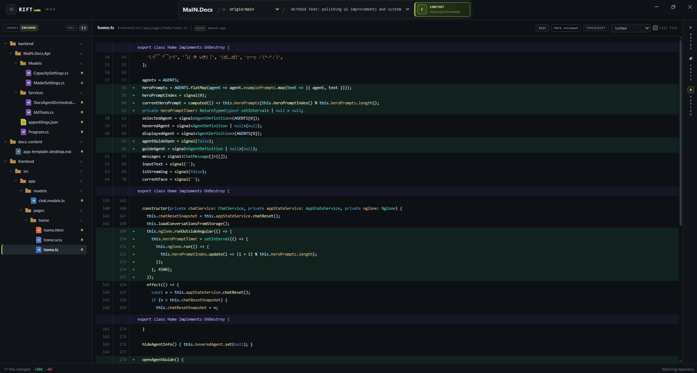

# Rift

> A visual, AI-native workspace for understanding, reviewing, and refining code changes.

[](./version.json)
[](#getting-started)
[](./LICENSE)

AI can produce code faster than developers can responsibly review it. Rift is built for the new bottleneck: making sense of a growing stream of generated and human-written changes before they become part of the codebase.



## Getting Started

Rift currently supports Windows and macOS. The installer builds the desktop application locally, so **Node.js 24 or newer** and Git are required.

### Windows

Run in PowerShell:

```powershell
irm https://raw.githubusercontent.com/wisedev-pstach/RiftCode/main/install.ps1 | iex
```

Open a new terminal, then launch Rift from any repository:

```powershell
rift .
```

You can also pass a repository path:

```powershell
rift C:\path\to\repository
```

### macOS

Run in a shell:

```sh
curl -fsSL https://raw.githubusercontent.com/wisedev-pstach/RiftCode/main/install.sh | sh
```

Ensure `~/.local/bin` is on your `PATH`, then launch Rift:

```sh
rift .
```

### AI Agents

Rift discovers supported coding agents installed on your machine. Install and authenticate at least one to use AI review and chat features:

- [OpenCode](https://opencode.ai/)
- [Claude Code](https://docs.anthropic.com/en/docs/claude-code/overview)

Repository browsing, diffs, notes, review tracking, and editing work without an AI agent.

## Why Rift

The AI era changed the shape of software development. Writing code is cheaper, but understanding code is not.

Large diffs arrive quickly. Generated changes often look plausible while hiding subtle regressions, unnecessary complexity, or assumptions that do not fit the surrounding system. Traditional diff viewers show what changed, and chat windows can discuss code, but the developer is left to connect those two worlds manually.

Rift brings the review surface and the AI conversation together:

- **See the complete change** in a focused, syntax-highlighted diff instead of reviewing code through chat fragments.
- **Navigate by structure** with a changed-files tree or the full repository explorer.
- **Build review state** by marking files or entire folders reviewed and keeping notes attached to exact lines.
- **Ask with real context** by sending selected lines, files, review notes, and project references to a coding agent.
- **Stay in control** by inspecting the agent's tool activity and editing the working tree directly when a fix is needed.

Rift does not try to replace engineering judgment. It gives that judgment a workspace designed for the volume and velocity of AI-assisted development.

## What You Can Do

| Review | Understand | Act |
| --- | --- | --- |
| Compare the working tree, branches, and commits | Browse changed files as a tree or open the full repository | Edit changed files directly from the diff |
| Switch between unified and side-by-side diffs | Search file names and repository contents | Ask OpenCode or Claude Code about selected lines |
| Expand to full-file context | Attach project details, links, files, images, and directories | Continue agent conversations with retained context |
| Mark files and folders reviewed | Add notes anchored to precise changed lines | Run an independent AI review and reconsider it after fixes |

Additional details include light and dark themes, per-repository review sessions, changed-region navigation, syntax-aware rendering, and live repository refresh.

## Review Workflow

1. Open a repository with `rift .`.
2. Choose the working tree, a branch comparison, or a commit.
3. Walk the changed-file tree and inspect each diff in context.
4. Mark files or complete folders reviewed as you go.
5. Select suspicious lines to add a note or ask an AI coding agent.
6. Apply or make fixes, refresh the comparison, and review what changed again.

Rift is a local desktop application, not a hosted repository service. For AI features it invokes supported agent CLIs; selected code and context may be sent to model providers according to the configuration, authentication, and privacy terms of those tools.

## Development

```sh
git clone https://github.com/wisedev-pstach/RiftCode.git
cd RiftCode
npm ci
npm run dev
```

Useful commands:

```sh
npm run typecheck  # TypeScript and Angular template checks
npm run build      # Production Electron build
npm run package    # Package for the current platform
```

Rift is built with Electron, Angular, TypeScript, and electron-vite.

## License

Rift is available under the [MIT License](./LICENSE).
